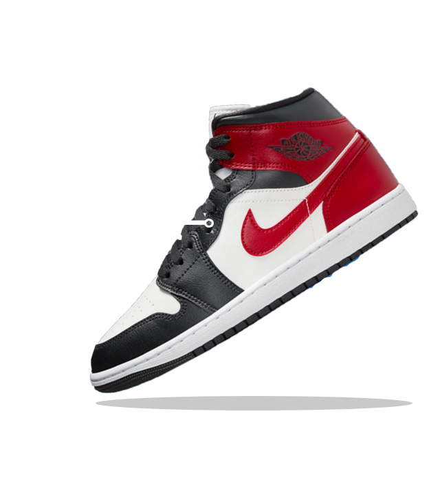
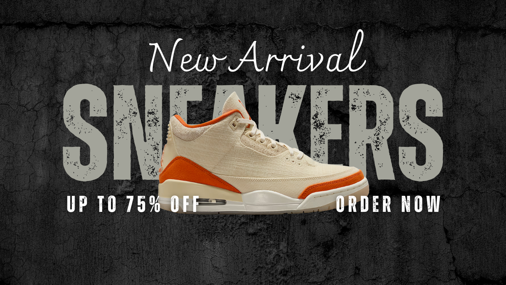
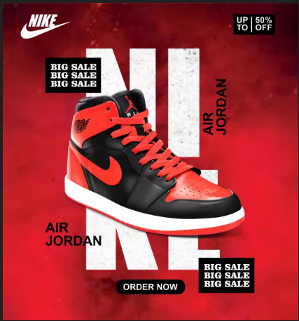

# E-Commerce Prototype

A **Next.js + Tailwind CSS + Framer Motion** e-commerce prototype showcasing a modern sportswear collection. This is a demo/prototype for portfolio purposes.

---

## 🌟 Features

- Responsive hero section with animations (Framer Motion)
- Product listing page with cards
- Product details page with size selection
- Add to bag button (simulated)
- Smooth mobile-friendly design
- Tailwind CSS styling

---

## 💻 Tech Stack

- **Frontend:** Next.js 13+, React 18  
- **Styling:** Tailwind CSS  
- **Animations:** Framer Motion  
- **Images:** Public folder (local assets)  

---

## 📸 Screenshots / Demo

  

 

---

## 🚀 Installation

1. Clone the repo:

```bash
git clone https://github.com/yourusername/ecommerce-prototype.git
cd ecommerce-prototype

nstall dependencies:
npm install
# or
yarn install

Run the development server:

npm run dev
# or
yarn dev

Open http://localhost:3000 in your browser.

🛠 Usage

Navigate to /shop to see the product listing.

Click a product to see details and select sizes.

Click “Add to Bag” to simulate adding a product.

⚡ Future Improvements

Connect to a real backend (API + database)

Implement shopping cart and checkout

Add search and filter functionality

Optimize image loading with Next.js Image component


📄 License

This project is for portfolio/demo purposes only.

---

### ✅ Notes:

1. Replace `https://github.com/yourusername/ecommerce-prototype.git` with your actual repo URL.  
2. Replace the screenshot paths with actual images from your `/public/images/`.  
3. You can add more features as you develop, like banners, carousel, or filters.  

---